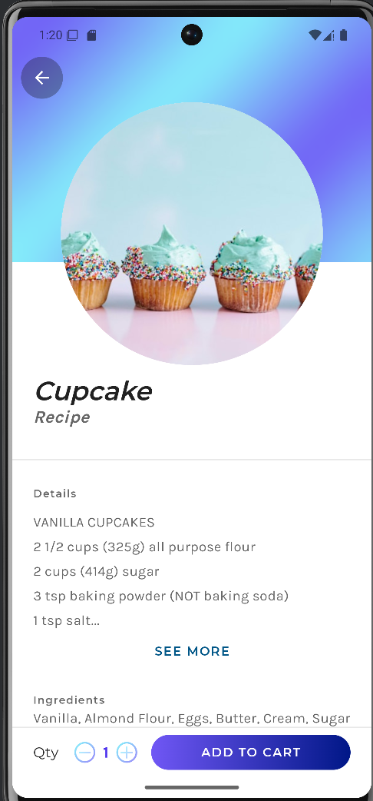
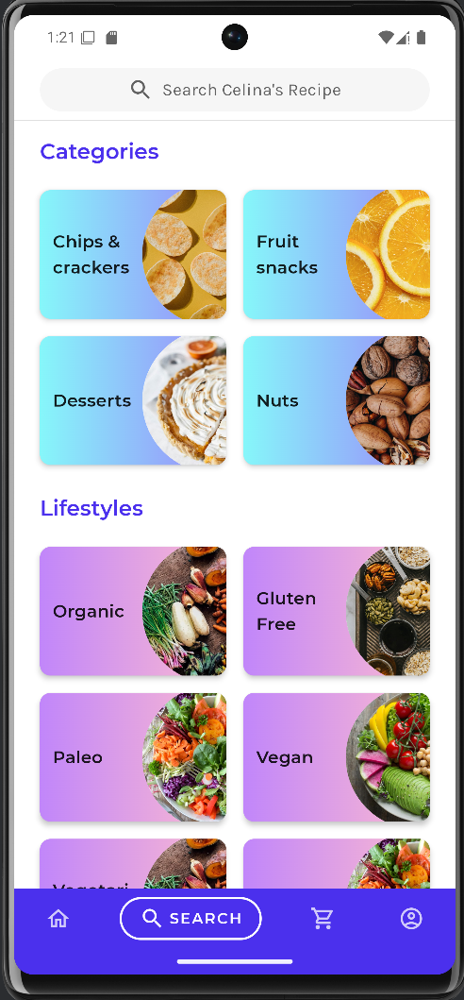
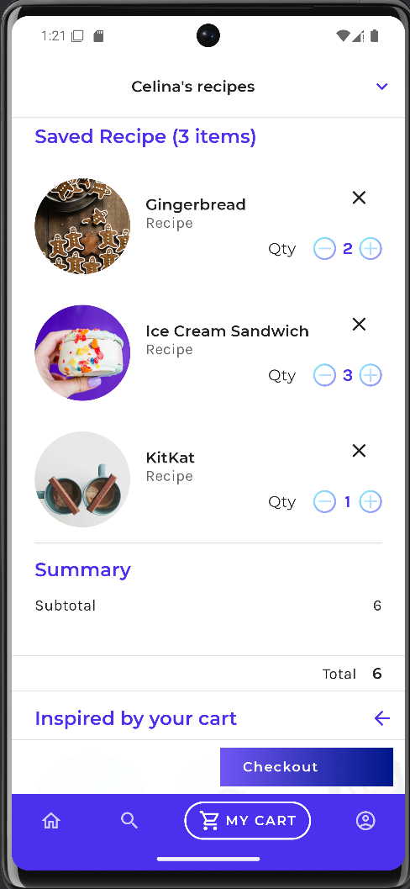

# Celina's recipe

Celina's recipe is a sample snack recipe ordering app built with Kotlin.

This sample showcases:

* How to implement a custom design system
* Custom layout
* Animation

## Screenshots

### Status: 🚧 In progress 🚧

Jetsnack is still under development and some screens are not yet implemented.

## Features

### Recipe details
